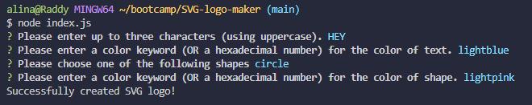

# SVG-logo-maker


## Description
A simple SVG logo maker which allows a user to create a customized logo based on input word (no more than 3 characters), shape, text color and shape color. The created SVG logo is saved as .svg file.

## Table of Contents
- [Installation](#installation)
- [Usage](#usage)
- [Contributing](#contributing)
- [License](#license)
- [Questions](#questions)

## Installation
Clone the repository.
```
git clone git@github.com:AlinaB108/SVG-logo-maker.git
```
Create package.json:
```
npm init -y
```
Install Inquirer:
```
npm i inquirer@8.2.4
```
And then install jest to test shapes.test.js file:
```
npm i jest
```

## Usage
To test shapes.test.js type this in Integrated terminal
``` 
npm run test
```
To answer prompt questions and create SVG logo type this in Integrated terminal:
```
node index.js
```
Test example


Prompt questions example



Logo example


[Recording of Application](https://watch.screencastify.com/v/gP5CGnr5mOiN5MidDtMZ)

## Contributing
1. Fork the project by clicking Fork in the top-right corner of the page.
2. Clone the repository.
3. Create a new branch to work on.
4. Commit the changes.
5. Push to the branch.
6. Create a pull request.


## License
[](https://opensource.org/licenses/MIT)

https://opensource.org/licenses/MIT 
    
## Questions
If you have any questions, send me a message [GitHub](https://github.com/AlinaB108) or send me an email: [alinachristabel108@gmail.com](alinachristabel108@gmail.com)
